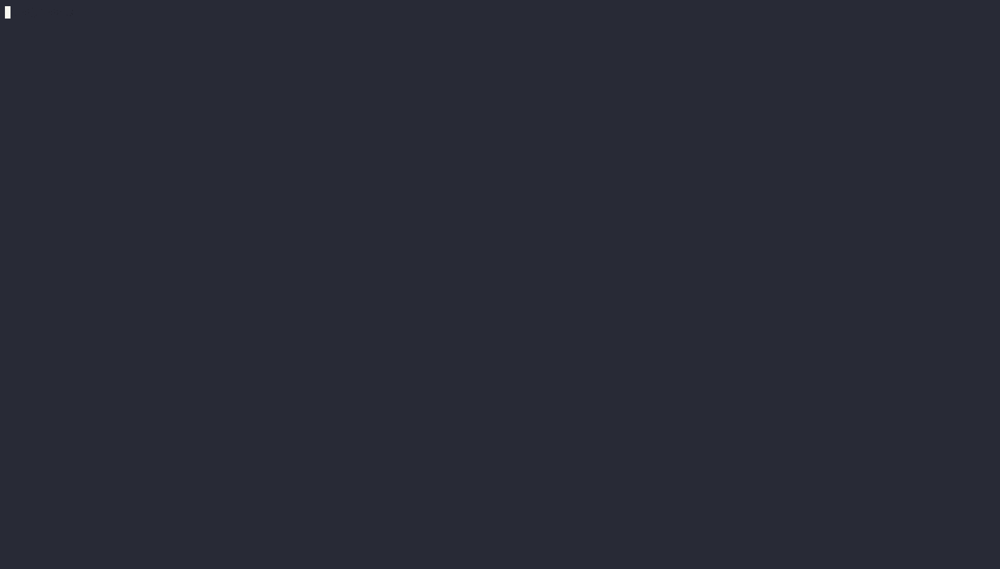

import { Aside } from '@/components/docs'

Bienvenue dans la documentation de VulnAPI !



---

## Qu'est-ce que VulnAPI ?

VulnAPI est un outil DAST Open Source qui analyse les API à la recherche de vulnérabilités et de risques de sécurité. Il fournit des rapports sur toutes les vulnérabilités détectées au cours de l'analyse, incluant le niveau de risque, la vulnérabilité, la description et l'opération effectuée lorsque la vulnérabilité a été détectée.

VulnAPI propose trois méthodes pour analyser les API :
* **Via l'interface CLI de type Curl** : invoquez directement l'interface de ligne de commande avec des paramètres similaires aux commandes curl.
* **Via les contrats OpenAPI** : utilisez une spécification OpenAPI pour énumérer tous les points de terminaison à analyser.
* **Via GraphQL** : pointez VulnAPI vers un point de terminaison GraphQL pour y rechercher des vulnérabilités.

## Installation

Avant d'effectuer votre première analyse avec VulnAPI, vous devez le télécharger et l'installer. Veuillez suivre les instructions sur la page [Installation](./installation).

<Aside type="tip">Prêt à analyser ? Suivez le guide [Première analyse](./first-scan).</Aside>

## Découverte

Avant de procéder à l'analyse, vous pouvez découvrir des informations utiles sur l'API cible à l'aide de la commande `discover`.

### Commande Discover

Pour découvrir des informations utiles sur l'API cible, exécutez la commande suivante :

```bash
vulnapi discover api [API_URL]
```

Exemple de sortie :

```bash
| WELL-KNOWN PATHS |                URL                 |
|------------------|------------------------------------|
| OpenAPI          | http://localhost:5000/openapi.json |
| GraphQL          | N/A                                |


| TECHNOLOGIE/SERVICE |     VALUE     |
|---------------------|---------------|
| Framework           | Flask:2.2.3   |
| Language            | Python:3.7.17 |
| Server              | Flask:2.2.3   |
```

### Via l'interface CLI de type Curl

Pour effectuer une analyse à l'aide de la CLI de type Curl, exécutez la commande suivante :

```bash
vulnapi scan curl [API_URL] [CURL_OPTIONS]
```

Remplacez `[API_URL]` par l'URL de l'API à analyser, et `[CURL_OPTIONS]` par toute option curl supplémentaire que vous souhaitez inclure.

### Via les contrats OpenAPI

Pour effectuer une analyse à l'aide de contrats OpenAPI, exécutez la commande suivante :

```bash
echo "[JWT_TOKEN]" | vulnapi scan openapi [PATH_OR_URL_TO_OPENAPI_FILE]
```

Remplacez `[PATH_OR_URL_TO_OPENAPI_FILE]` par le chemin ou l'URL du fichier JSON du contrat OpenAPI et `[JWT_TOKEN]` par le jeton JWT à utiliser pour l'authentification.

### Via GraphQL

Pour effectuer une analyse sur un point de terminaison GraphQL, exécutez la commande suivante :

```bash
vulnapi scan graphql [GRAPHQL_ENDPOINT] -H "Authorization: Bearer [JWT_TOKEN]"
```

## Résultats de sortie

La CLI fournit des rapports détaillés sur toutes les vulnérabilités détectées lors de l'analyse. En voici un exemple condensé :

|          OPERATION           | RISK LEVEL | CVSS 4.0 SCORE |             OWASP              |         VULNERABILITY          |
|------------------------------|------------|----------------|--------------------------------|--------------------------------|
| GET /                        | Medium     |            5.1 | API8:2023 Security             | X-Frame-Options Header is      |
|                              |            |                | Misconfiguration               | missing                        |
|                              | High       |            9.3 | API2:2023 Broken               | JWT Token is not verified      |
|                              |            |                | Authentication                 |                                |
|                              | Info       |            0.0 | API8:2023 Security             | HSTS Header is missing         |
|                              |            |                | Misconfiguration               |                                |

Consultez la référence des [Formats de sortie](./reference/output-formats) pour obtenir tous les détails sur les colonnes du tableau, les formats JSON/YAML et l'intégration CI/CD.

## Vulnérabilités détectées

Toutes les vulnérabilités détectées par le projet sont répertoriées à cette URL : [Vulnérabilités d'API détectées](./vulnerabilities).

> Davantage de vulnérabilités et de bonnes pratiques seront ajoutées dans les prochaines versions. Si vous avez des suggestions ou des demandes concernant de nouvelles vulnérabilités ou de bonnes pratiques à inclure, n'hésitez pas à ouvrir un ticket (issue) ou à soumettre une pull request.

## Support proxy

Le scanner prend en charge les configurations de proxy pour analyser les API situées derrière un serveur proxy. Pour utiliser un proxy, définissez les variables d'environnement `HTTP_PROXY` ou `HTTPS_PROXY` avec l'URL du proxy.

Un argument de commande `--proxy` est également disponible pour spécifier l'URL du proxy.

## Options supplémentaires

Consultez la [Référence de la CLI](./reference/cli) pour obtenir la documentation complète des commandes.

## Télémétrie

Le scanner collecte des données d'utilisation anonymes afin de contribuer à l'amélioration de l'outil. Ces données comprennent le nombre d'analyses effectuées, le nombre de vulnérabilités détectées et la sévérité de ces dernières. Aucune information sensible n'est collectée. Vous pouvez désactiver la télémétrie en transmettant le drapeau (flag) `--sqa-opt-out`.

## Clause de non-responsabilité (Disclaimer)

Ce scanner est fourni uniquement à des fins éducatives et d'information. Il ne doit pas être utilisé à des fins malveillantes ou pour attaquer un système sans autorisation préalable. Respectez toujours la sécurité et la vie privée d'autrui.
