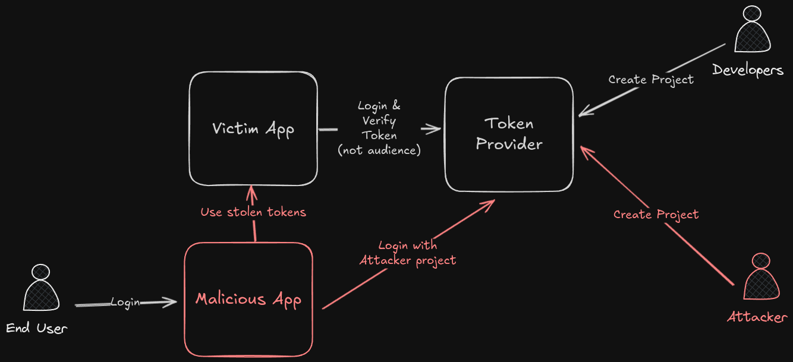

<table>
  <tr>
    <th>Gravité</th>
    <td>Élevée</td>
  </tr>
  <tr>
    <th>Classifications</th>
    <td>
      <ul>
        <li><a href="https://cwe.mitre.org/data/definitions/20.html">CWE-20: Improper Input Validation</a></li>
        <li><a href="https://cwe.mitre.org/data/definitions/287.html">CWE-287: Improper Authentication</a></li>
      </ul>
    </td>
  </tr>
  <tr>
    <th>Catégorie OWASP</th>
    <td>
      <a href="https://owasp.org/API-Security/editions/2023/en/0xa2-broken-authentication/">OWASP API2:2023 Broken Authentication</a>
    </td>
  </tr>
</table>

Une vulnérabilité survient lorsqu'un JSON Web Token (JWT) est signé par le même service mais que l'émetteur (la source du token) et/ou l'audience (le destinataire prévu) ne sont pas vérifiés. Cela peut mener à des risques de sécurité, car cela signifie qu'un attaquant pourrait créer un JWT forgé avec la signature du même service et manipuler les champs d'émetteur et d'audience. Sans vérification adéquate, le service peut accepter le token forgé, accordant potentiellement un accès non autorisé ou compromettant la sécurité du système.

Pour plus de détails, consultez la [documentation jwtop sur l'attaque de relais inter-services](https://www.cerberauth.com/docs/jwtop/vulnerabilities/cross-service-relay-attack/).



## Services concernés

### Fournisseurs d'identité sociale

La plupart des fournisseurs d'identité sociale génèrent des ID tokens en utilisant la même paire de clés. En plus des vérifications d'intégrité du JWT, l'`issuer` et l'`audience` doivent être vérifiés pour s'assurer que le token a été généré depuis le client attendu.

Voici quelques fournisseurs d'identité sociale concernés par cette vulnérabilité :

| Service | Description | Documentation |
| ------- | ----------- | ------------- |
| **Google** | Google fournit des ID tokens générés depuis la même paire de clés. L'`audience` doit être vérifiée pour s'assurer que le token a été généré depuis le `Client Id` attendu du projet Google. | [Valider un Id Token Google](https://developers.google.com/identity/openid-connect/openid-connect#validatinganidtoken) |
| **Facebook** | Facebook fournit des ID tokens générés depuis la même paire de clés. L'`audience` doit être vérifiée pour s'assurer que le token a été généré depuis le `Facebook App Id` attendu. | [Valider un token Facebook](https://developers.facebook.com/docs/facebook-login/limited-login/token/validating/) |
| **Microsoft** | Microsoft fournit des ID tokens générés depuis la même paire de clés. L'`audience` doit être vérifiée pour s'assurer que le token a été généré depuis le `Microsoft App Id` attendu. | [Valider les Id Tokens Microsoft](https://learn.microsoft.com/en-us/entra/identity-platform/id-tokens#validate-tokens) |
| **Apple** | Apple fournit des ID tokens générés depuis la même paire de clés. L'`audience` doit être vérifiée pour s'assurer que le token a été généré depuis le `client_id` attendu de l'app Apple. | [Valider les Id Tokens Apple](https://developer.apple.com/documentation/sign_in_with_apple/sign_in_with_apple_rest_api/authenticating_users_with_sign_in_with_apple#3383773) |

### Services IAM / d'autorisation

Certains services IAM génèrent des tokens JWT en utilisant la même paire de clés. En plus des vérifications d'intégrité du JWT, des contrôles supplémentaires doivent être effectués pour s'assurer que le token a été généré depuis le client / tenant attendu.

Voici quelques services concernés :

| Service                                     | Description | Documentation |
| ------------------------------------------- | ----------- | ------------- |
| **Firebase** / **Google Identity Platform** | Firebase fournit des ID tokens générés depuis la même paire de clés. L'émetteur et l'audience doivent être vérifiés pour s'assurer que le token a été généré depuis le projet Firebase attendu. | [Vérifier un Id Token Firebase](https://firebase.google.com/docs/auth/admin/verify-id-tokens) |

## Exemple

Voici un exemple de JWT (ID Token) émis par Google :

```json
{
  "iss": "https://accounts.google.com",
  "azp": "1234987819200.apps.googleusercontent.com",
  "aud": "1234987819200.apps.googleusercontent.com",
  "sub": "10769150350006150715113082367",
  "at_hash": "HK6E_P6Dh8Y93mRNtsDB1Q",
  "hd": "example.com",
  "email": "jsmith@example.com",
  "email_verified": "true",
  "iat": 1353601026,
  "exp": 1353604926,
  "nonce": "0394852-3190485-2490358"
}
```

Dans cet exemple, le claim `aud` représente l'audience, qui est l'ID client du projet Google. Le service doit vérifier le claim `aud` pour s'assurer que le token a été généré depuis le `Client Id` attendu du projet Google.

Supposons qu'un attaquant crée un nouveau projet avec le même service et génère un token. L'attaquant peut relayer le token vers le projet de la victime et usurper l'identité de l'utilisateur, faisant croire au projet de la victime que l'utilisateur est authentifié.

Voici un exemple de token forgé :

```json
{
  "iss": "https://accounts.google.com",
  "azp": "1234987819201.apps.googleusercontent.com",
  "aud": "1234987819201.apps.googleusercontent.com",
  "sub": "10769150350006150715113082367",
  "at_hash": "HK6E_P6Dh8Y93mRNtsDB1Q",
  "hd": "example.com",
  "email": "jsmith@example.com",
  "email_verified": "true",
  "iat": 1353601026,
  "exp": 1353604926,
  "nonce": "0394852-3190485-2490358"
}
```

Remarquez que le claim `aud` a été changé pour le `Client Id` du projet de l'attaquant. Si le service ne vérifie pas le claim `aud`, il acceptera le token forgé et croira que l'utilisateur est authentifié.

## Comment tester ?

Créez un nouveau projet avec le même service et générez un token (via un processus d'authentification légitime). Puis, essayez de relayer le token vers votre projet d'origine et voyez si le service accepte le token ou non. Si le service accepte le token, alors il est vulnérable à cette attaque.

Ce test nécessite des étapes manuelles. VulnAPI n'automatise pas encore ce scan. Créez un second projet avec le même fournisseur d'identité, obtenez un token valide pour ce projet, puis envoyez-le à l'API de votre projet d'origine. Si l'API accepte la requête, elle est vulnérable.

## Quel est l'impact ?

L'impact de cette vulnérabilité est qu'un attaquant pourrait créer un autre projet avec le même service. Lorsqu'un utilisateur s'authentifie avec le projet malveillant, l'attaquant peut relayer le token vers le projet de la victime et usurper l'identité de l'utilisateur, faisant croire au projet de la victime que l'utilisateur est authentifié.

## Comment corriger ?

Pour corriger cette vulnérabilité, le service doit suivre les recommandations du fournisseur de tokens. La plupart du temps, l'`issuer` et l'`audience` doivent être vérifiés pour s'assurer que le token a été généré depuis le client attendu. Le service doit continuer à vérifier l'intégrité du token et les autres claims pour s'assurer qu'il n'a pas été falsifié.
