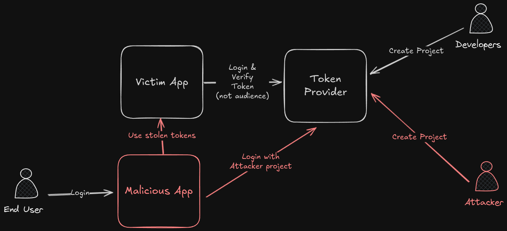

# Token Cross Service Relay Attack

<table>
  <tr>
    <th>Severity</th>
    <td>High</td>
  </tr>
  <tr>
    <th>Classifications</th>
    <td>
      * [CWE-20: Improper Input Validation](https://cwe.mitre.org/data/definitions/20.html)
      * [CWE-287: Improper Authentication](https://cwe.mitre.org/data/definitions/287.html)
    </td>
  </tr>
  <tr>
    <th>OWASP Category</th>
    <td>
      [OWASP API2:2023 Broken Authentication](https://owasp.org/API-Security/editions/2023/en/0xa2-broken-authentication/)
    </td>
  </tr>
</table>

A vulnerability arises when a JSON Web Token (JWT) is signed by the same service but doesn't verify the issuer (the source of the token) and/or the audience (the intended recipient). This can lead to security risks, as it means an attacker could create a forged JWT with the same service signature and manipulate the issuer and audience fields. Without proper verification, the service may accept the forged token, potentially granting unauthorized access or compromising the system's security.



## Services impacted

### Social Identity Providers

Most of the social identity providers generate ID tokens using the same key pair. In addition of JWT integrity verifications, the `issuer` and `audience` must be verified to ensure the token has been generated from the expected client.

Here are some social identity providers that are impacted with this vulnerability:

| Service | Description | Documentation |
| ------- | ----------- | ------------- |
| **Google** | Google provides ID tokens generated from the same key pair. The `audience` must be verified to ensure the token has been generated from the expected Google Project's `Client Id`. | [Validate Google Id Token](https://developers.google.com/identity/openid-connect/openid-connect#validatinganidtoken) |
| **Facebook** | Facebook provides ID tokens generated from the same key pair. The `audience` must be verified to ensure the token has been generated from the expected `Facebook App Id`. | [Validate Facebook Token](https://developers.facebook.com/docs/facebook-login/limited-login/token/validating/) |
| **Microsoft** | Microsoft provides ID tokens generated from the same key pair. The `audience` must be verified to ensure the token has been generated from the expected `Microsoft App Id`. | [Validate Microsoft Id Tokens](https://learn.microsoft.com/en-us/entra/identity-platform/id-tokens#validate-tokens) |
| **Apple** | Apple provides ID tokens generated from the same key pair. The `audience` must be verified to ensure the token has been generated from the expected Apple App `client_id`. | [Validate Apple Id Tokens](https://developer.apple.com/documentation/sign_in_with_apple/sign_in_with_apple_rest_api/authenticating_users_with_sign_in_with_apple#3383773) |

### IAM / Authorization Services

Some IAM Services generate JWT tokens using the same key pair. In addition of JWT integrity verifications, some additional checks must be performed to ensure the token has been generated from the expected client / tenant.

Here are some of the services that are impacted:

| Service                                     | Description | Documentation |
| ------------------------------------------- | ----------- | ------------- |
| **Firebase** / **Google Identity Platform** | Firebase provides ID tokens generated from the same key pair. The issuer and audience must be verified to ensure the token has been generated from the expected Firebase Project. | [Firebase Verify Id Token](https://firebase.google.com/docs/auth/admin/verify-id-tokens) |

## Example

Here is an example of JWT (ID Token) issued by Google:

```json
{
  "iss": "https://accounts.google.com",
  "azp": "1234987819200.apps.googleusercontent.com",
  "aud": "1234987819200.apps.googleusercontent.com",
  "sub": "10769150350006150715113082367",
  "at_hash": "HK6E_P6Dh8Y93mRNtsDB1Q",
  "hd": "example.com",
  "email": "jsmith@example.com",
  "email_verified": "true",
  "iat": 1353601026,
  "exp": 1353604926,
  "nonce": "0394852-3190485-2490358"
}
```

In this example, the `aud` claim represents the audience, which is the client ID of the Google Project. The service must verify the `aud` claim to ensure the token has been generated from the expected Google Project's `Client Id`.

Let's say an attacker creates a new project with the same service and generates a token. The attacker can relay the token to the victim's project and impersonate the user making the victim's project believe that the user is authenticated.

Here is an example of a forged token:

```json
{
  "iss": "https://accounts.google.com",
  "azp": "1234987819201.apps.googleusercontent.com",
  "aud": "1234987819201.apps.googleusercontent.com",
  "sub": "10769150350006150715113082367",
  "at_hash": "HK6E_P6Dh8Y93mRNtsDB1Q",
  "hd": "example.com",
  "email": "jsmith@example.com",
  "email_verified": "true",
  "iat": 1353601026,
  "exp": 1353604926,
  "nonce": "0394852-3190485-2490358"
}
```

Notice that the `aud` claim has been changed to the attacker's project `Client Id`. If the service doesn't verify the `aud` claim, it will accept the forged token and believe that the user is authenticated.

## How to test?

Create a new project with the same service and generate a token (through a legitimate authentication process). Then, try to relay the token to your original project and see if the service accepts the token or not. If the service accepts the token, then the service is vulnerable to this attack.

TODO: VulnAPI Command

## What is the impact?

The impact of this vulnerability is that an attacker could create another project with the same service. When user will authenticate with the malicious project, the attacker can relay the token to the victim's project and impersonate the user making the victim's project believe that the user is authenticated.

## How to remediate?

To remediate this vulnerability, the service must follow tokens provider's guidelines. Most of the time, the `issuer` and `audience` must be verified to ensure the token has been generated from the expected client. The service must keep verifying token integrity and other claims to ensure the token is not tampered with.
